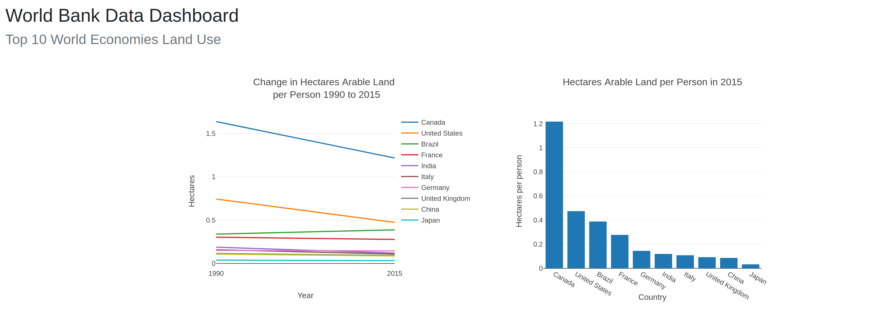
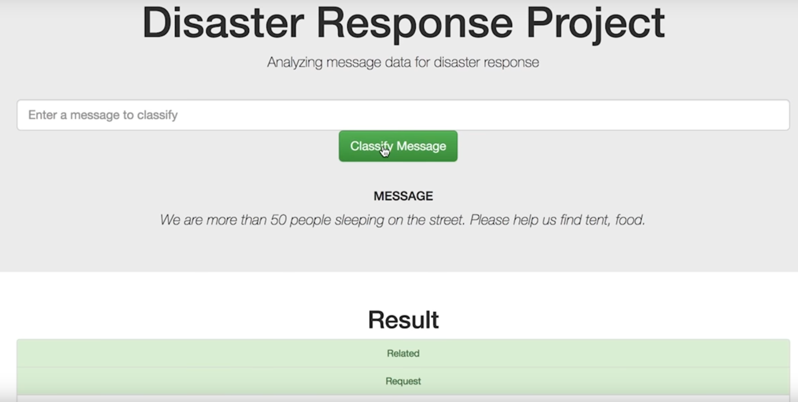
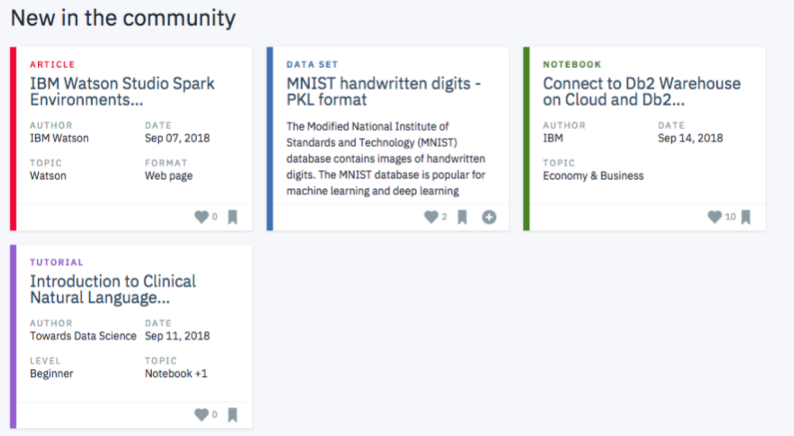
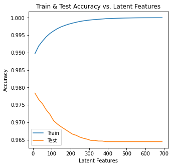
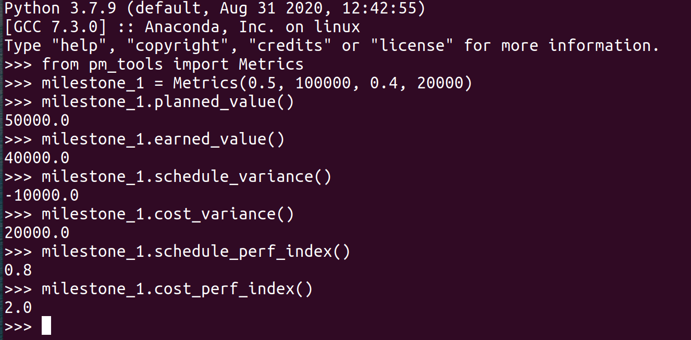
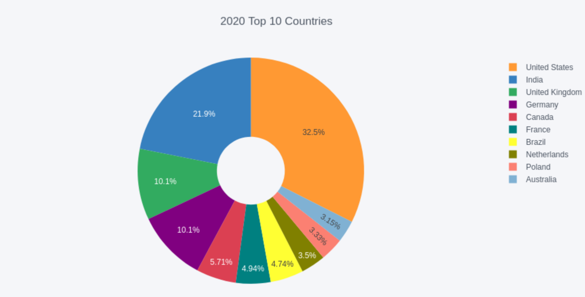

# Projects

# [Project 1: Predicting Customer Churn with Spark](https://github.com/rabadzhiyski/SparkProject)
Define what customer would churn from Sparkify's online services. I used PySpark on IBM Watson cluster to engineer features and to build classification model to predict churn. [Blog post also available.](https://plamen-rabadzhiyski.medium.com/sparkify-make-your-customers-stay-e7a4307870be)

Customer churn is a very challenging area and it gives many opportunities for analyses. It was important to find a way to get a realistic probability for users who are prompt to churn based on some features like gender, location, workday, songs played, etc. With the help of several PySpark libraries I explored the data, engineered the most appropriate features, designed a machine learning pipeline and chose the most appropriate model for predicting churn. It is a classification task that required Logistic Regression, Random Forest Classifier or other classification model.

# [Project 2: Web Application on Heroku](https://github.com/rabadzhiyski/web_app)

World Bank Data Dashboard of top 10 World Economies. Created a web-application hosted on Heroku that extracts, transforms and load data into a Dashboard.

https://example-worldbank-app.herokuapp.com/

# [Project 3: Disaster Response Classification Web Application](https://github.com/rabadzhiyski/DRC-Disaster_Response_Classification) 

Analyzing data for disaster response based on messages generated through different channels. The program extracts the messages, transforms, loads, and runs ML based on RandomForestClassifier to classify messages into 35 different categories.

The web application could be used during a disaster event (e.g. an earthquake or hurricane), to classify a disaster message into several categories,so that the appropriate aid agencies are notified.

# [Project 4: Recommmendations with IBM](https://github.com/rabadzhiyski/recommendationsIBM)
I analyzed the interactions that users have with articles on the IBM Watson Studio platform, and made recommendations to them about new articles they will like.

I used the below methods to build the project.
- Exploratory Data Analysis
- Rank Based Recommendations
- User-User Based Collaborative Filtering
- Matrix Factorization

# [Project 5: PyPI Application for Project Management](https://github.com/rabadzhiyski/pm_tools)

The tool calculates the most popular metrics in traditional/predictive project management (aka "Waterfall"). All you need to do is to run it and after that call "Metrics()" with the respective inputs: **planned percent complete (float), budget (int), actual percent complete (float), actual cost (int).** 

The package is available on [PyPI](https://pypi.org/project/pm-tools/)

# [Project 6: StackOverflow Surveys Investigation](https://github.com/rabadzhiyski/StackOverflow_Survey_2011-2020)
This is a project related to StackOverflow development survey of 2011 and 2012. With some exploratory data analyses we answer three questions:
 - What were the most popular languages in 2011 and now?
 - What were the top 10 countries in 2011 and now?
 - Did Linux and Mac OS win the fight against Microsoft?

[Blog post also available.](https://plamen-rabadzhiyski.medium.com/what-has-changed-for-a-decade-fc5052fd0614)

    
  
